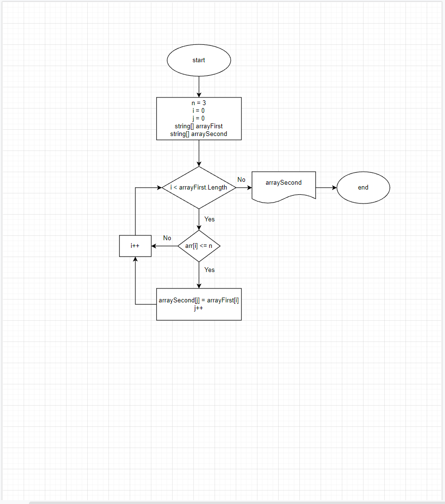

# Итоговая проверочная работа #

## Задача:

Написать программу, которая из имеющегося массива строк формирует новый массив их строк, длина которых меньше, либо равна 3 символам. Первоначальный массив можно ввести с клавиатуры, либо задать на старте выполнения аогоритма.
При решении не рекомендуется пользоваться коллекциями, лучше обойтись исключительно массивами.

## Алгоритм решения задачи:
1. Создали строковый массив.
2. Создали метод, заполняющий массив (*FillArray*) значениями, введенными пользователем.
3. Создали метод вывода заполненного массива поэлементно на экран (*PrintArray*)
4. Создали метод, определяющий длину нового массива (*GetSizeOfSecondArray*)
5. Создали условие окончания решения, если размер второго массива равен нулю
6. Создали метод, переносящий определенные элементы по условию задачи из изначального массива в новый массив(*TransferElements*)
7. Вывели на экран новый массив

# Блок-схема

